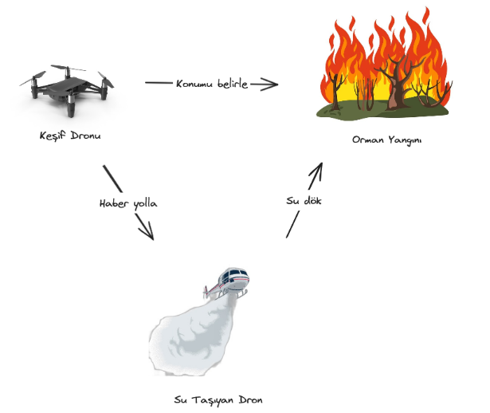

# 🛰️ Autonomous Fire Detection Drone System (OpenCV + IoT)

This repository contains a **simplified OpenCV-based fire detection module** from a larger academic project titled:

> 🧠 *Development of Deep Learning Models for Autonomous Control in the Internet of Flying Things*

🎓 **Graduation Thesis – Pamukkale University – Computer Engineering**  
👨‍💻 **Author**: Faruk Emin Karatay  
📆 **Date**: May 2024  

---

## 🔥 Project Summary

This project explores the development of an **autonomous fire detection and intervention system using drones**. The complete thesis involves:

- **Two coordinated drones** (explorer + firefighting)
- **OpenCV-based fire detection**
- **MQTT communication protocol**
- **Simulation in Unreal Engine 4 with AirSim**
- **Integration with real DJI Tello drone**

📌 **Important Note:**  
This repository **only includes the fire detection code using OpenCV.** The full implementation (e.g. drone communication, AirSim setup, MQTT logic, DJI integration) is not shared publicly.

---

## 🎥 Video Demonstration

  
▶️ *Click above to watch a full demo of the system.*

---

## 🧪 Sample Screenshot

  
*A frame from simulation where fire is detected via OpenCV.*

---

## 🧠 Technologies Used

- Python
- OpenCV
- MQTT Protocol
- DJI Tello SDK
- AirSim
- Unreal Engine 4
